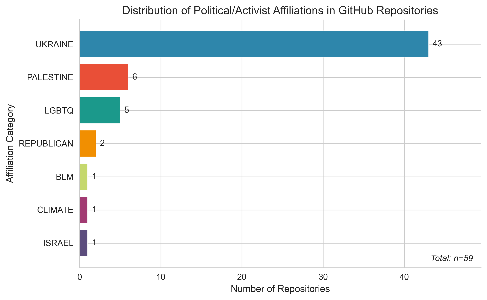
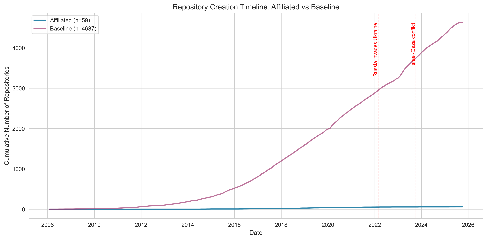
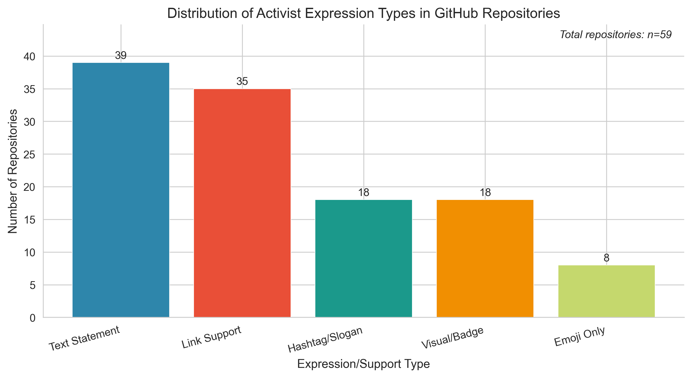
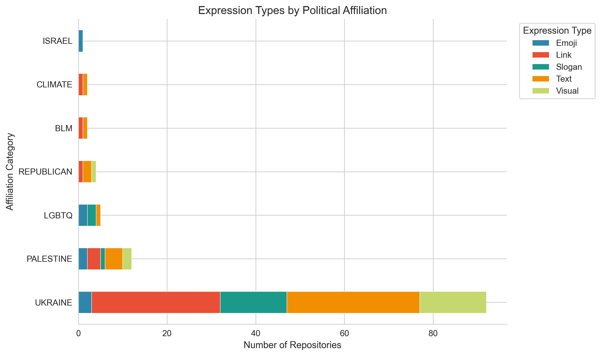
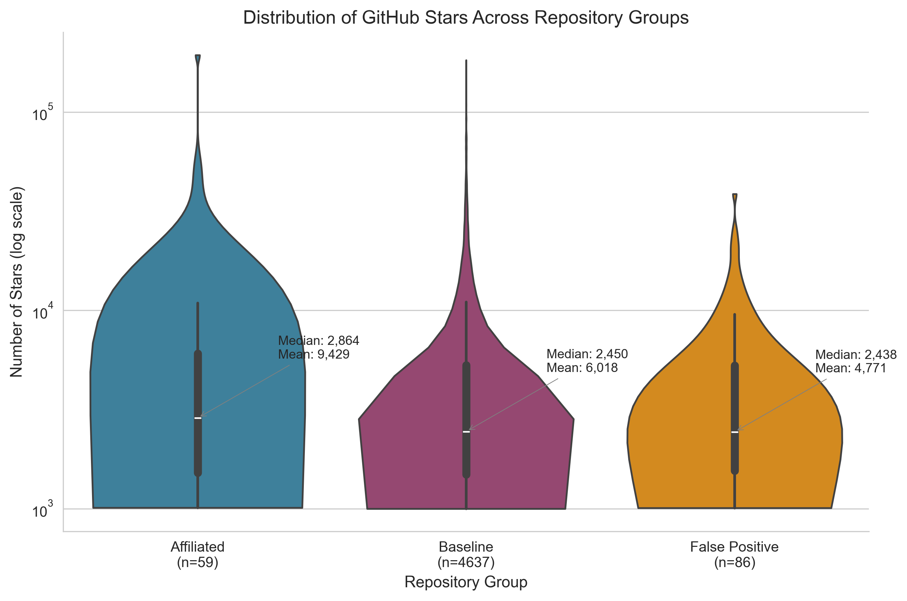
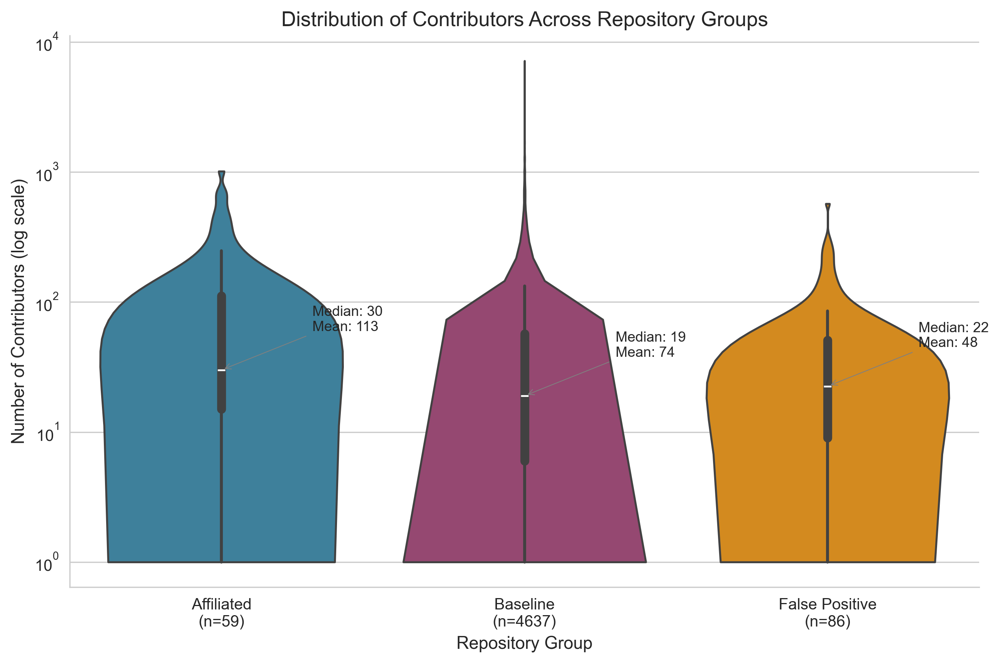
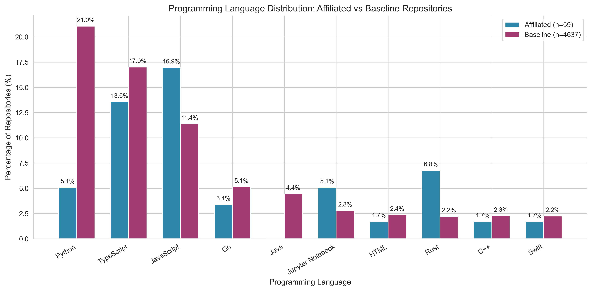
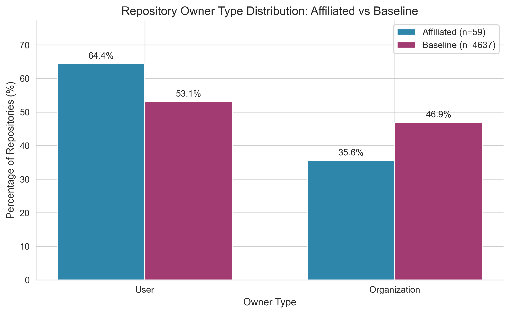
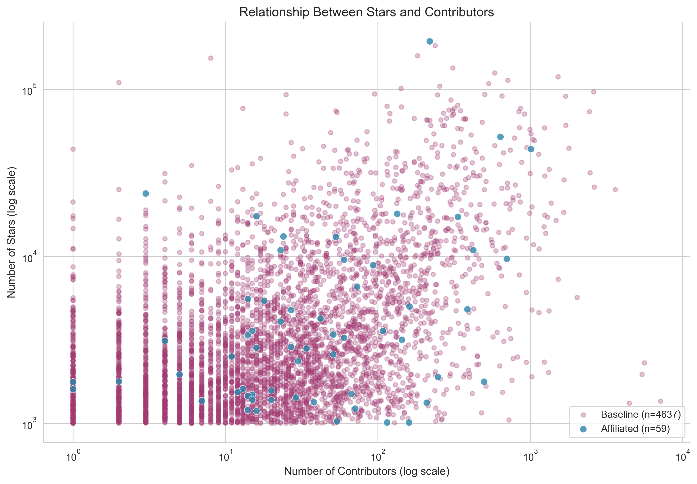

# Research Results: Emoji and Political Affiliation in GitHub Repositories

**Generated:** 2025-12-01 12:26:40

---

## Table of Contents

1. [Executive Summary](#executive-summary)
2. [Methodology Overview](#methodology-overview)
3. [RQ1: Repository Types and Affiliations](#rq1-what-kinds-of-github-repositories-use-politically-meaningful-emojis)
4. [RQ2: Expression Methods and False Positives](#rq2-how-do-these-repositories-express-political-or-activist-support-and-how-many-cases-are-false-positives)
5. [RQ3: Repository Characteristics](#rq3-what-are-the-characteristics-of-these-repositories-and-their-contributors)
6. [Discussion](#discussion)
7. [Summary of Key Findings](#summary-of-key-findings)
8. [List of Figures](#list-of-figures)

---

## Executive Summary

This study analyzed **4,696** GitHub repositories containing political or activist emojis 
to understand how developers use emoji symbols to signal political and social affiliations in their projects. 
Through a rigorous multi-stage validation process combining AI-based classification and manual verification, 
we identified **59** repositories (1.26%) 
with genuine political or activist affiliations.

### Key Findings at a Glance

| Metric | Value |
|--------|-------|
| Total repositories analyzed | 4,696 |
| Validated activist repositories | 59 (1.26%) |
| Most common affiliation | UKRAINE (72.9%) |
| Most common expression type | Text Statement (66.1%) |
| False positive rate (AI classifier) | 59.3% |
| Total stars across activist repos | 556,305 |
| Contributors statistical significance | p = 0.0015 |

---

## Methodology Overview

### Data Collection

We collected 4,696 GitHub repositories that met the following criteria:

1. **Minimum popularity threshold**: At least 1,000 stars
2. **Emoji presence**: README contains at least one political or activist-related emoji
3. **Political emoji categories**: Ukraine flag 🇺🇦, Palestine flag 🇵🇸, rainbow 🌈, Pride flags 🏳️‍🌈 🏳️‍⚧️, raised fists ✊✊🏿✊🏾, and other activist symbols

### Validation Process

1. **AI Classification (DeepSeek)**: Initial filtering using large language model to identify potential activist repositories
2. **Manual Validation**: Human review of 145 AI-flagged repositories
3. **Expression Categorization**: Classification of how each repository expresses political support

### Expression Categories Defined

| Category | Definition | Example |
|----------|------------|---------|
| Text Statement | Explicit written declaration of support | "We stand with Ukraine" |
| Link Support | URLs to donation pages or information | "[Donate to Ukraine](...)" |
| Hashtag/Slogan | Use of movement hashtags | #StandWithUkraine, #BLM |
| Visual/Badge | Images, badges, or banners | Support badges in README |
| Emoji Only | Only emoji without context | Just 🇺🇦 in description |

### Analysis Framework

- **RQ1**: Repository types and affiliation distribution
- **RQ2**: Expression methods and false positive analysis
- **RQ3**: Repository characteristics comparison (stars, contributors, ownership)

---

## RQ1: What kinds of GitHub repositories use politically meaningful emojis?

### Overview

Among the 4,696 popular repositories that contain at least one political or activist emoji, 
we identified **59 repositories** with a clearly validated activist affiliation 
(approximately **1.26%** of all emoji-bearing repositories). 
This finding indicates that political emojis in popular GitHub projects are predominantly decorative 
rather than intentional political signals.

### Political Affiliation Distribution

The most common affiliations were **UKRAINE** (n=43, 72.9%), 
followed by **PALESTINE** (n=6, 10.2%) 
and **LGBTQ** (n=5, 8.5%). 
The dominance of Ukraine-related repositories (72.9%) reflects the global developer 
community's response to the 2022 Russian invasion, demonstrating how geopolitical events 
influence open-source project documentation.

| Affiliation | Count | Percentage | Primary Emojis |
|-------------|-------|------------|----------------|
| UKRAINE | 43 | 72.9% | 🇺🇦 💙 💛 🌻 |
| PALESTINE | 6 | 10.2% | 🇵🇸 🍉 |
| LGBTQ | 5 | 8.5% | 🏳️‍🌈 🏳️‍⚧️ 🌈 |
| REPUBLICAN | 2 | 3.4% | 🐘 🔥 |
| BLM | 1 | 1.7% | ✊🏿 ✊🏾 ✊ |
| ISRAEL | 1 | 1.7% | 🇮🇱 |
| CLIMATE | 1 | 1.7% | 🌍 🌱 |

### Technology Stack Analysis

In terms of programming languages, activist-affiliated repositories span diverse technology ecosystems:

| Language | Count | Percentage |
|----------|-------|------------|
| JavaScript | 10 | 16.9% |
| TypeScript | 8 | 13.6% |
| C# | 7 | 11.9% |
| PHP | 5 | 8.5% |
| Rust | 4 | 6.8% |
| Python | 3 | 5.1% |
| HCL | 3 | 5.1% |
| Jupyter Notebook | 3 | 5.1% |
| Vue | 2 | 3.4% |
| Shell | 2 | 3.4% |

The prevalence of **JavaScript** (16.9%) and 
**TypeScript** (13.6%) suggests that web development 
and frontend technologies are particularly associated with activist signaling, 
possibly due to the documentation-heavy nature of these projects and their visibility to end users.

### Repository Ownership Patterns

- **Individual Users:** 38 repositories (64.4%)
- **Organizations:** 21 repositories (35.6%)

Individual developers are more likely to express political stances (64.4% vs 35.6%), 
suggesting that personal projects provide more freedom for political expression compared to organizational repositories.

### Top 10 Activist Repositories by Stars

| Rank | Repository | Stars | Affiliation | Language |
|------|------------|-------|-------------|----------|
| 1 | [trekhleb/javascript-algorithms](https://github.com/trekhleb/javascript-algorithms) | 193,622 | UKRAINE | JavaScript |
| 2 | [starship/starship](https://github.com/starship/starship) | 51,811 | UKRAINE | Rust |
| 3 | [Leaflet/Leaflet](https://github.com/Leaflet/Leaflet) | 43,814 | UKRAINE | JavaScript |
| 4 | [trekhleb/homemade-machine-learning](https://github.com/trekhleb/homemade-machine-learning) | 23,746 | UKRAINE | Jupyter Notebook |
| 5 | [sweetalert2/sweetalert2](https://github.com/sweetalert2/sweetalert2) | 17,951 | UKRAINE | JavaScript |
| 6 | [trekhleb/learn-python](https://github.com/trekhleb/learn-python) | 17,400 | UKRAINE | Python |
| 7 | [verdaccio/verdaccio](https://github.com/verdaccio/verdaccio) | 17,236 | UKRAINE | TypeScript |
| 8 | [Tyrrrz/YoutubeDownloader](https://github.com/Tyrrrz/YoutubeDownloader) | 13,135 | UKRAINE | C# |
| 9 | [LGUG2Z/komorebi](https://github.com/LGUG2Z/komorebi) | 13,058 | PALESTINE | Rust |
| 10 | [retejs/rete](https://github.com/retejs/rete) | 10,887 | UKRAINE | TypeScript |

*The top activist repository has **193,622** stars, demonstrating that political signaling 
occurs even in the most popular open-source projects.*

### Most Commonly Used Political Emojis

| Emoji | Count | Primary Association |
|-------|-------|---------------------|
| 🇺🇦 | 31 | Ukraine |
| ❤️ | 14 | Support |
| 🌈 | 5 | LGBTQ+ |
| 🏳️‍🌈 | 5 | Pride |
| 🇷🇺 | 5 | Russia/Anti-war |
| 🇵🇸 | 4 | Palestine |
| 🇺🇸 | 4 | Various |
| 💛 | 2 | Ukraine |
| 💙 | 2 | Ukraine |
| 😔 | 2 | Various |
| 🏳️‍⚧️ | 2 | Trans Pride |
| 🔥 | 2 | Various |
| 🌱 | 1 | Various |
| 🍉 | 1 | Palestine |
| ✊🏾 | 1 | BLM |

### Repository Creation Timeline

| Year | Repositories Created |
|------|---------------------|
| 2010 | 1 |
| 2011 | 1 |
| 2014 | 2 |
| 2015 | 1 |
| 2016 | 6 |
| 2017 | 9 |
| 2018 | 8 |
| 2019 | 10 |
| 2020 | 9 |
| 2021 | 6 |
| 2022 | 3 |
| 2023 | 1 |
| 2025 | 2 |

### Associated Figures

**Figure 1: Distribution of Political/Activist Affiliations**

*Figure 1. Distribution of activist affiliations among the 59 validated repositories. 
The plot shows the proportion of repositories supporting each movement, 
with Ukraine-related activism dominating the distribution.*

**Figure 8: Repository Creation Timeline**

*Figure 8. Timeline showing when activist-affiliated repositories were created, 
revealing temporal patterns in political signaling adoption.*

---

## RQ2: How do these repositories express political or activist support, and how many cases are false positives?

### Overview

We classified the way each repository expresses support into five categories: 
**text statements**, **link-based support**, **slogans or hashtags**, **visual banners/badges**, and **emoji-only**. 
This analysis reveals that most activist repositories use multiple channels to express support, 
with only a minority relying solely on emoji symbols.

### Expression Type Distribution

Among the 59 validated activist repositories:

| Expression Type | Count | Percentage | Description |
|-----------------|-------|------------|-------------|
| Text Statement | 39 | 66.1% | Explicit written statement of support in README |
| Link Support | 35 | 59.3% | Links to donation pages, petitions, or information resources |
| Hashtag/Slogan | 18 | 30.5% | Use of hashtags like #StandWithUkraine or slogans |
| Visual/Badge | 18 | 30.5% | Badges, banners, or images showing support |
| Emoji Only | 8 | 13.6% | Only emoji symbols without additional context |

**Key Insight:** Text Statement is the most common support type (66.1%), 
indicating that developers prefer explicit, contextual methods over symbolic signaling alone.

### Emoji-Only Signaling Analysis

Emoji-only signals were relatively rare, with only **8 repositories** 
(13.6%) relying solely on activist emojis without any supporting text, link, or image. 
This finding is significant because it suggests that:

1. **Emojis alone are insufficient** for meaningful political communication
2. **Context matters** - developers recognize the need for explicit messaging
3. **Detection systems** cannot rely solely on emoji presence for classification

### Multi-Expression Patterns

- **Repositories using multiple expression types:** 38 (64.4%)
- **Repositories using single expression type:** 21 (35.6%)

**Most Common Expression Combinations:**

| Combination | Count |
|-------------|-------|
| Link Support + Text Statement | 12 |
| Link Support + Text Statement + Visual/Badge | 12 |
| Hashtag/Slogan + Link Support | 4 |
| Hashtag/Slogan + Link Support + Text Statement | 3 |
| Hashtag/Slogan + Text Statement + Visual/Badge | 2 |
| Hashtag/Slogan + Link Support + Text Statement + Visual/Badge | 2 |
| Link Support + Visual/Badge | 1 |
| Text Statement + Visual/Badge | 1 |

### Validity Classification: Explicit vs Implicit Signaling

| Validity Type | Count | Percentage | Description |
|---------------|-------|------------|-------------|
| Explicit | 52 | 88.1% | Clear, unambiguous statement of support |
| Implicit | 7 | 11.9% | Contextual inference required |

The high proportion of explicit signals (88.1%) demonstrates that 
most developers who choose to express political support do so clearly and intentionally.

### False Positive Analysis

When considering all 4,696 repositories that contain political emojis, 
only **59** (approximately **1.26%**) were confirmed as truly activist.

#### AI Classifier Performance

| Metric | Value |
|--------|-------|
| Repositories flagged by AI | 145 |
| True positives (validated) | 59 |
| False positives | 86 |
| Precision | 40.7% |
| False positive rate | 59.3% |

#### Common False Positive Patterns

Analysis of false positives revealed several common patterns:

1. **Decorative emoji use**: Rainbow 🌈 used for color themes, not LGBTQ+ support
2. **Technical contexts**: Emojis in commit messages or changelogs
3. **Cultural references**: Watermelon 🍉 in food/agriculture projects
4. **Design elements**: Flag emojis for internationalization features
5. **Coincidental presence**: Activist emojis appearing in unrelated contexts

#### Signal Strength Assessment

Political emojis in popular GitHub repositories are a **weak but non-random signal** 
of activist content. With only 1.26% of emoji-bearing repositories 
being truly activist, emoji detection alone is insufficient for reliable classification. 
Contextual analysis is essential.

### Expression Patterns by Affiliation

| Affiliation | Text | Link | Hashtag | Badge | Emoji Only |
|-------------|------|------|---------|-------|------------|
| UKRAINE | 30 | 29 | 15 | 15 | 3 |
| PALESTINE | 4 | 3 | 1 | 2 | 2 |
| LGBTQ | 1 | 0 | 2 | 0 | 2 |
| REPUBLICAN | 2 | 1 | 0 | 1 | 0 |
| BLM | 1 | 1 | 0 | 0 | 0 |
| CLIMATE | 1 | 1 | 0 | 0 | 0 |
| ISRAEL | 0 | 0 | 0 | 0 | 1 |

### Associated Figures

**Figure 2: Support Type Distribution**

*Figure 2. Support types used by activist-affiliated repositories. 
Text statements and link support are the dominant methods, while emoji-only signaling is rare.*

**Figure 7: Affiliation by Expression Type**

*Figure 7. Distribution of expression types across different political affiliations, 
showing how different movements prefer different communication strategies.*

---

## RQ3: What are the characteristics of these repositories and their contributors?

### Overview

We compared the 59 activist-affiliated repositories with two baselines: 
repositories with political emojis but no validated affiliation (4,637 repos) 
and repositories flagged as false positives (86 repos). 
This comparison reveals important differences in project characteristics.

### Statistical Testing Summary

| Variable | Test | Statistic | p-value | Significant (α=0.05) | Effect Size |
|----------|------|-----------|---------|---------------------|-------------|
| Stars | Mann-Whitney U | 146,652 | 0.3407 | No ✗ | N/A |
| Contributors | Mann-Whitney U | 169,644 | 0.0015 | Yes ✓ | N/A |

### Repository Popularity (Stars)

Activist repositories show **higher star counts** compared to baseline repositories.

| Group | N | Median | Mean | Std Dev | Min | Max | Total |
|-------|---|--------|------|---------|-----|-----|-------|
| Affiliated | 59 | 2,864 | 9,429 | 26,116 | 1,012 | 193,622 | 556305 |
| Baseline | 4,637 | 2,450 | 6,018 | 11,501 | 1,000 | 182,605 | - |
| False Positive | 86 | 2,438 | 4,771 | 5,955 | 1,009 | 38,620 | - |

**Statistical Result:** The difference in star counts is **not statistically significant** 
(U = 146,652, p = 0.3407).
 This suggests that political signaling is not associated with repository popularity.

### Community Engagement (Contributors)

In terms of contributors, activist repositories show **higher contributor counts**.

| Group | N | Median | Mean | Std Dev |
|-------|---|--------|------|---------|
| Affiliated | 59 | 30 | 113 | 194 |
| Baseline | 4,637 | 19 | 74 | 242 |
| False Positive | 86 | 22 | 48 | 82 |

**Statistical Result:** The difference in contributor counts is **statistically significant** 
(U = 169,644, p = 0.0015).
 This suggests that activist signaling is associated with more collaborative, community-driven projects.

### Owner Type Comparison

| Group | Organization % | Individual User % |
|-------|---------------|-------------------|
| Affiliated | 35.6% | 64.4% |
| Baseline | 46.9% | 53.1% |
| False Positive | 37.2% | 62.8% |

Individual developers are more likely to express political stances (64.4% vs 53.1%), 
suggesting personal projects provide more freedom for political expression.

### Programming Language Comparison

| Rank | Affiliated Repos | Baseline Repos |
|------|------------------|----------------|
| 1 | JavaScript (10) | Python (976) |
| 2 | TypeScript (8) | TypeScript (788) |
| 3 | C# (7) | JavaScript (527) |
| 4 | PHP (5) | Go (238) |
| 5 | Rust (4) | Java (206) |

### Associated Figures

**Figure 3: Stars Comparison Across Groups**

*Figure 3. Distribution of star counts for activist-affiliated repositories compared to baseline groups.*

**Figure 4: Contributors Comparison Across Groups**

*Figure 4. Distribution of contributor counts, showing higher engagement in activist-affiliated repositories.*

**Figure 5: Language Distribution**

*Figure 5. Primary programming languages comparison between affiliated and baseline repositories.*

**Figure 6: Owner Type Distribution**

*Figure 6. Owner types showing the proportion of individual vs organizational ownership.*

**Figure 9: Stars vs Contributors Relationship**

*Figure 9. Scatter plot showing the relationship between repository popularity and community size.*

---

## Discussion

### Key Findings

#### 1. Political Emoji Usage is Rare but Meaningful

Only 1.26% of repositories containing political emojis 
actually have genuine activist affiliations. This indicates that political emojis 
are predominantly used for decorative purposes in the developer community. However, 
when political signaling does occur, it is typically explicit and intentional 
(88.1% explicit vs 11.9% implicit).

#### 2. Ukraine Dominates Activist Signaling

With 72.9% of activist repositories supporting Ukraine, 
the 2022 Russian invasion clearly had a significant impact on the open-source community. 
This reflects broader global solidarity movements and the developer community's 
response to geopolitical crises.

#### 3. Multi-Modal Expression is Preferred

Developers rarely rely on emoji-only signaling (13.6%). 
Instead, 64.4% use multiple expression methods, 
combining text statements, links, badges, and hashtags for comprehensive messaging.

#### 4. Community Engagement Matters

The statistically significant difference in contributor counts (p = 0.0015) 
suggests that activist signaling is associated with more collaborative projects. 
This may indicate that community-oriented projects are more likely to take public stances on social issues.

### Limitations

1. **Sample bias**: Only repositories with 1,000+ stars were analyzed
2. **Temporal scope**: Data represents a snapshot; political movements evolve
3. **Classification accuracy**: AI classifier has 59.3% false positive rate
4. **Cultural context**: Emoji interpretations vary across cultures
5. **Language limitations**: Analysis focused on English README content

### Implications for Research and Practice

1. **For researchers**: Emoji detection alone is insufficient for political content classification
2. **For platforms**: Political signaling in open source deserves consideration in moderation policies
3. **For developers**: README badges provide effective channels for social advocacy
4. **For organizations**: Political positioning in open source is increasingly visible

---

## Summary of Key Findings

### RQ1: Repository Types and Affiliations

- **59 repositories** (1.26%) contain genuine activist affiliations
- **UKRAINE** dominates with 72.9% of affiliated repositories
- Primary languages: JavaScript, TypeScript, C#
- Individual users own 64.4% of activist repositories
- Total stars across activist repos: 556,305

### RQ2: Expression Methods and False Positives

- **Text Statement** is the most common expression type (66.1%)
- Only **13.6%** rely on emoji-only signals
- **64.4%** use multiple expression methods
- **88.1%** explicit vs **11.9%** implicit signaling
- **59.3%** false positive rate among AI predictions
- Political emojis are a weak signal: only 1.26% of emoji repos are truly activist

### RQ3: Repository Characteristics

- Affiliated repos have **higher** median stars (2,864 vs 2,450)
- Affiliated repos have **higher** median contributors (30 vs 19)
- Stars difference is **not statistically significant** (p = 0.3407)
- Contributors difference is **statistically significant** (p = 0.0015)

---

## List of Figures

| Figure | Filename | Research Question | Description |
|--------|----------|-------------------|-------------|
| Figure 1 | figure1_affiliation_distribution | RQ1 | Distribution of political affiliations |
| Figure 2 | figure2_support_type_distribution | RQ2 | Expression type distribution |
| Figure 3 | figure3_stars_comparison | RQ3 | Stars comparison across groups |
| Figure 4 | figure4_contributors_comparison | RQ3 | Contributors comparison |
| Figure 5 | figure5_language_distribution | RQ3 | Programming language distribution |
| Figure 6 | figure6_owner_type_distribution | RQ3 | Owner type comparison |
| Figure 7 | figure7_affiliation_by_expression | RQ2 | Expression by affiliation |
| Figure 8 | figure8_creation_timeline | RQ1 | Repository creation timeline |
| Figure 9 | figure9_stars_contributors_scatter | RQ3 | Stars vs contributors scatter |

---

*Report generated on 2025-12-01 12:26:40*
