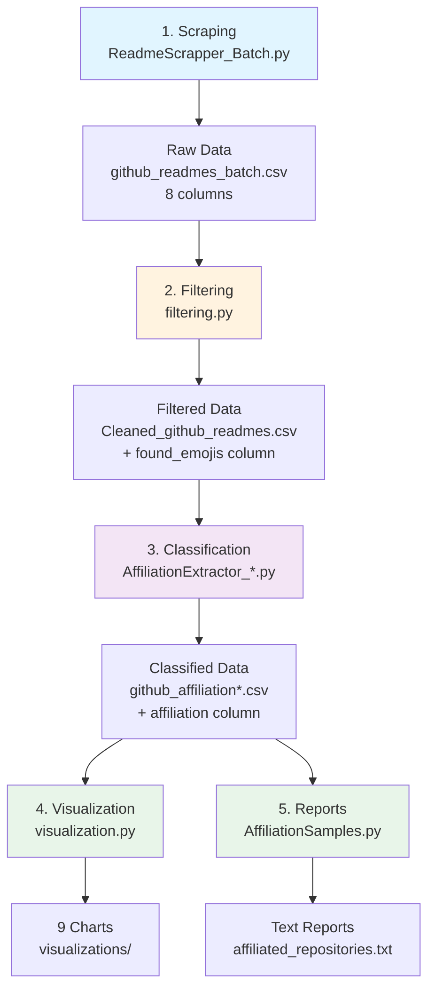

# GitHub Repository Scraper & Political Affiliation Analyzer

A Python research pipeline for analyzing political and social activism in GitHub repositories through emoji usage and LLM classification.

## 🎯 Overview

Scrape 100K+ GitHub repositories → Filter by political emojis → Classify affiliations with AI → Visualize patterns

**Key Features:**
- 🚀 **Ultra-fast parallel scraping** (80K+ repos/hour with 20 tokens)
- ⚡ **Smart caching** (near-instant re-runs, 7-day cache)
- 🔍 41 political emojis across 7 categories (Palestine/Israel, Ukraine, BLM, Climate, LGBTQ+, etc.)
- 🤖 Dual LLM support (DeepSeek or OpenAI)
- 📊 Comprehensive analysis (9 visualization charts + statistical reports)
- 🎯 Adaptive range sizing (optimized for star density)
- 🔄 Auto re-scanning to bypass GitHub's 1,000 result limit

## 📊 Research Workflow



**Pipeline Steps:**
1. **Scrape** → Collect repo metadata + README (8K/hour)
2. **Filter** → Keep only repos with political emojis (1-5% retention)
3. **Classify** → LLM determines affiliation (8 categories)
4. **Visualize** → Generate 9 analytical charts
5. **Report** → Create text summaries

## �️ Core Components

| Script | Purpose | Key Feature |
|--------|---------|-------------|
| `ReadmeScrapper_Batch.py` | Scrape repos | 8 tokens, auto re-scan, 8K/hour |
| `filtering.py` | Filter by emojis | 41 emojis, 7 categories |
| `AffiliationExtractor_deepseek.py` | Classify (DeepSeek) | Cost-effective, prompt caching |
| `AffiliationExtractor_OpenAI.py` | Classify (OpenAI) | gpt-4o-mini, enhanced prompts |
| `visualization.py` | Create charts | 9 charts, 300 DPI |
| `StatisticalAnalysis.py` | Statistical analysis | Correlation, distribution, chi-square |
| `AffiliationSamples.py` | Generate reports | Text summaries |

**Political Emojis (41 total):**
- 🇮🇱 🇵🇸 🍉 (Israel/Palestine) • 🇺🇦 🇷🇺 (Ukraine/Russia) • ✊🏾 ✊🏿 (BLM)
- ♻️ 🌱 (Climate) • 🌈 🏳️‍🌈 🏳️‍⚧️ (LGBTQ+) • ♀️ 💔 (Women's Rights)

**Affiliation Categories:** israel, palestine, blm, ukraine, climate, feminism, lgbtq, none

## � Quick Start

### 1. Installation

```bash
# Clone repository
git clone https://github.com/AMRIZH/EmojiandAffiliation.git
cd EmojiandAffiliation

# Create virtual environment
python -m venv venv
.\venv\Scripts\Activate.ps1  # Windows
source venv/bin/activate      # Linux/Mac

# Install dependencies
pip install -r requirements.txt
```

### 2. Configure `.env` File

Create `.env` in project root:

```bash
# GitHub Tokens (get from https://github.com/settings/tokens)
GITHUB_TOKEN_1=github_pat_xxxxx
GITHUB_TOKEN_2=github_pat_xxxxx
# ... up to GITHUB_TOKEN_20

# LLM API Key (choose one)
deepseek_api_key=sk-xxxxx    # or
openai_api_key=sk-xxxxx
```

**Token Setup:** GitHub Settings → Developer Settings → Personal Access Tokens → Fine-grained tokens
- Permissions: Contents (Read), Metadata (Read)
- 20 tokens = 100K requests/hour (recommended for optimal speed)

## 📖 Usage

### Step 1: Scrape Repositories

```bash
python ReadmeScrapper_Batch.py
```

**What it does:** Scrapes repos with 500-200K stars using parallel scanning and smart caching
- **Performance:** 80K+ repos/hour with 20 tokens (configurable: 4-20 parallel scan workers)
- **Caching:** First run scans & caches, subsequent runs load instantly from cache
- **Cache lifetime:** 7 days (auto-refresh if older)
- **Optimization:** Smart initial range sizing based on star density
- **Output:** `github_readmes_batch.csv` (9 columns: owner, name, stars, url, description, contributors, topics, created_at, readme)
- **Time:** ~1-2 hours for 100K repos (first run), <10 seconds (cached)
- **Logging:** Detailed reports saved to `logs/scraping_report.txt`
- Auto re-scans when hitting GitHub's 1,000 result limit with aggressive range reduction (min 2 stars)

### Step 2: Filter by Emojis

```bash
python filtering.py
```

**What it does:** Filters repos containing 41 political emojis
- Output: `Cleaned_github_readmes.csv` (+ `found_emojis` column)
- Typical retention: 1-5% of original repos

### Step 3: Classify Affiliations

```bash
# Option A: DeepSeek (cheaper)
python AffiliationExtractor_deepseek.py

# Option B: OpenAI (more accurate)
python AffiliationExtractor_OpenAI.py
```

**What it does:** Uses LLM to classify repos into 8 categories
- Output: `github_affiliation.csv` or `github_affiliation_openai.csv` (+ `affiliation` column)
- Categories: israel, palestine, blm, ukraine, climate, feminism, lgbtq, none

### Step 4: Visualize

```bash
python visualization.py
```

**What it does:** Generates 9 charts analyzing the data
- Output: `visualizations/` folder with PNG files (300 DPI)

### Step 5: Statistical Analysis (Optional)

```bash
python StatisticalAnalysis.py
```

**What it does:** Performs comprehensive statistical analysis
- Descriptive statistics (mean, median, std, quartiles, skewness, kurtosis)
- Correlation analysis (Pearson & Spearman)
- Distribution tests (normality, outliers)
- Affiliation comparisons (ANOVA, Kruskal-Wallis)
- Temporal trends analysis
- Chi-square tests (categorical associations)
- Output: 9 visualization charts + detailed report in `statistical_analysis/`

### Step 6: Generate Reports (Optional)

```bash
python AffiliationSamples.py
```

**What it does:** Creates text summaries of affiliated repos
- Output: `affiliated_repositories.txt` and `affiliated_repositories_simple.txt`

## 📁 Project Structure

```
githubscrapper/
├── ReadmeScrapper_Batch.py           # Step 1: Scrape repos
├── filtering.py                      # Step 2: Filter by emojis
├── AffiliationExtractor_deepseek.py  # Step 3: Classify (DeepSeek)
├── AffiliationExtractor_OpenAI.py    # Step 3: Classify (OpenAI)
├── visualization.py                  # Step 4: Generate charts
├── StatisticalAnalysis.py            # Step 5: Statistical analysis
├── AffiliationSamples.py             # Step 6: Text reports
├── .env                              # API keys (not in git)
├── requirements.txt                  # Dependencies
├── results/                          # Output CSVs
└── visualizations/                   # Output charts
```

## ⚡ Performance

| Configuration | Scan Speed | Scrape Speed | 100K Repos (First Run) | 100K Repos (Cached) |
|---------------|------------|--------------|------------------------|---------------------|
| 4 tokens, 4 parallel scanners | ~15-20 min | ~5K/hour | ~20 hours | <10 seconds |
| 10 tokens, 8 parallel scanners | ~8-10 min | ~12K/hour | ~8-10 hours | <10 seconds |
| 20 tokens, 12 parallel scanners | ~3-5 min | ~20K/hour | ~5-6 hours | <10 seconds |

**Key Performance Features:**
- ⚡ **Parallel scanning:** Up to 12 workers scan different star ranges simultaneously
- 💾 **Smart caching:** Cache stored in `cache/star_distribution_{min}_{max}.json`
- 🎯 **Adaptive sizing:** High stars (100K+) = 10K range, Low stars (<1K) = 100 range
- 🔄 **Optimized sleep:** 0.05s between requests (4x faster than before)
- 📊 **Real-time progress:** Detailed batch/chunk statistics with percentages

## 🔧 Configuration

Edit variables at the top of each script:

**`ReadmeScrapper_Batch.py`:**
```python
MIN_STARS = 500               # Minimum stars
MAX_STARS = 200000            # Maximum stars
NUMBER_OF_TOKENS = 20         # Total GitHub tokens in .env
MAX_WORKERS = 12              # Scraping workers (1-20)
PARALLEL_SCAN_WORKERS = 12    # Parallel scan workers (1-20, recommended: 4-12)
MIN_CONTRIBUTORS = 0          # Minimum contributors filter
README_CHAR_LIMIT = 10000000  # README character limit (10M)
```

**Configuration Guide:**
- `PARALLEL_SCAN_WORKERS`: Higher = faster scanning (recommended: match with tokens up to 12)
- `MAX_WORKERS`: Higher = faster scraping (recommended: match with logical processors)
- `MIN_CONTRIBUTORS`: Set to 5+ to filter out personal projects
- Cache automatically saved to `cache/` directory
- Logs automatically saved to `logs/scraping_report.txt`

**Emoji List** (in `filtering.py`):

```python
# In filtering.py - Edit POLITICAL_EMOJIS list

POLITICAL_EMOJIS = [
    # Israel (4 emojis)
    "🇮🇱",      # Flag: Israel
    "🤍",       # White Heart (with blue)
    "✡️",       # Star of David
    "🎗️",       # Reminder Ribbon
    
    # Palestine (4 emojis)
    "🇵🇸",      # Flag: Palestine
    "💚",       # Green Heart
    "🖤",       # Black Heart
    "🍉",       # Watermelon (symbolic)
    
    # Ukraine/Russia (4 emojis)
    "🇺🇦",      # Flag: Ukraine
    "💛",       # Yellow Heart
    "🌻",       # Sunflower (Ukraine national)
    "🇷🇺",      # Flag: Russia
    
    # Black Lives Matter (4 emojis)
    "✊",       # Raised Fist
    "✊🏾",      # Medium-Dark Skin Tone
    "✊🏿",      # Dark Skin Tone
    "🤎",       # Brown Heart
    
    # Climate Change (6 emojis)
    "♻️",       # Recycling Symbol
    "🌱",       # Seedling
    "🌍", "🌎", "🌏",  # Globe variants
    "🔥",       # Fire (climate disaster)
    
    # Women's Rights (6 emojis)
    "♀️",       # Female Sign
    "👩",       # Woman
    "💔",       # Broken Heart (#MeToo)
    "😔",       # Pensive Face
    "🍚",       # Rice (China #MeToo: 米兔)
    "🐰",       # Rabbit (China #MeToo: 米兔)
    
    # LGBTQ+ (3 emojis)
    "🌈",       # Rainbow
    "🏳️‍🌈",    # Rainbow Flag
    "🏳️‍⚧️",    # Transgender Flag
]
```

**To add new emojis:**
1. Add emoji to `POLITICAL_EMOJIS` list
2. Add descriptive comment
3. Run filtering again on same CSV (will re-process)

**To add new categories:**
1. Add emojis to list
2. Update `AffiliationExtractor_*.py` SYSTEM_PROMPT with new category
3. Add to `valid_affiliations` list in classifier

### LLM Classification Configuration

#### DeepSeek Settings
```python
MODEL_ID = "deepseek-chat"        # Model name
TEMPERATURE = 0.0                 # Deterministic (no randomness)
MAX_TOKENS = 10                   # One-word response only
SYSTEM_PROMPT = """..."""         # Cached at class level
MAX_RETRIES = 3                   # Retry on failure
```

#### OpenAI Settings
```python
MODEL_ID = "gpt-4o-mini"          # Latest mini model
TEMPERATURE = 0.0                 # Deterministic
MAX_TOKENS = 10                   # One-word response
MAX_RETRIES = 3                   # Retry on failure
```

**Cost Comparison** (approximate):
- **DeepSeek**: $0.14 per 1M input tokens, $0.28 per 1M output
- **OpenAI gpt-4o-mini**: $0.15 per 1M input tokens, $0.60 per 1M output
- **For 10K repos**: DeepSeek ~$0.50, OpenAI ~$1.50

### Batch Processing Configuration

```python
# In ReadmeScrapper_Batch.py

MIN_STARS = 500               # Lower = more repos (denser)
MAX_STARS = 200000            # Upper bound (adjust if needed)
NUMBER_OF_TOKENS = 20         # Total tokens in .env
MAX_WORKERS = 12              # Scraping parallelism
PARALLEL_SCAN_WORKERS = 12    # Scanning parallelism (1-20)
MIN_CONTRIBUTORS = 0          # Set >0 to filter small projects
README_CHAR_LIMIT = 10000000  # 10M chars (virtually unlimited)
```

**Optimization Tips:**
- `PARALLEL_SCAN_WORKERS = 12`: Sweet spot for most systems (4-12 recommended)
- `MIN_CONTRIBUTORS = 5`: Filters out personal/small projects
- `README_CHAR_LIMIT = 1000000`: 1M chars, faster, sufficient for classification
- Cache is automatically managed (7-day expiry)
- Smart range sizing automatically optimizes API calls

## 📊 Complete Data Schema

### Pipeline Data Flow

```
github_readmes_batch.csv (8 columns)
    ↓ filtering.py
Cleaned_github_readmes.csv (9 columns = 8 + found_emojis)
    ↓ AffiliationExtractor_*.py
github_affiliation*.csv (10 columns = 9 + affiliation)
```

### 1. Scraper Output: `github_readmes_batch.csv`

| Column | Type | Description | Example |
|--------|------|-------------|---------|
| `repo_owner` | String | GitHub username/org | `microsoft` |
| `repo_name` | String | Repository name | `vscode` |
| `repo_stars` | Integer | Star count | `162000` |
| `repo_url` | String | Full GitHub URL | `https://github.com/microsoft/vscode` |
| `description` | String | Repo description | `Visual Studio Code` |
| `contributors` | Integer | Contributor count | `428` |
| `topics` | String | Comma-separated | `editor, electron, typescript` |
| `created_at` | String | Repository creation date (ISO 8601) | `2015-09-03T19:23:00Z` |
| `readme` | String | README content (10M char limit) | `# Visual Studio Code\n\n...` |

**File Size**: ~500 MB for 100K repos (depending on README length)

### 2. Filtered Output: `Cleaned_github_readmes.csv`

Same as above **PLUS**:

| Column | Type | Description | Example |
|--------|------|-------------|---------|
| `found_emojis` | String | Space-separated emojis | `🏳️‍🌈 🌈` |

**Retention Rate**: Typically 1-5% of original repos (depends on emoji prevalence)

### 3. Classification Output: `github_affiliation.csv` or `github_affiliation_openai.csv`

Same as filtered **PLUS**:

| Column | Type | Description | Possible Values |
|--------|------|-------------|-----------------|
| `affiliation` | String | LLM classification | `israel`, `palestine`, `blm`, `ukraine`, `climate`, `feminism`, `lgbtq`, `none` |

**Typical Distribution** (example from research):
- `none`: 60-80% (neutral projects)
- `climate`: 5-10% (most common activism)
- `lgbtq`: 3-7%
- `ukraine`: 2-5%
- `palestine`: 1-3%
- `israel`: 1-2%
- `blm`: 1-2%
- `feminism`: 1-2%

### Data Types & Validation

**NULL Handling:**
- `description`: Empty string if null
- `topics`: Empty string if no topics
- `readme`: Empty string if not found
- `collaborators`: 0 if fetch failed
- `found_emojis`: Empty string if no matches
- `affiliation`: Defaults to "none" on error

**Character Limits:**
- `repo_owner`: ~100 chars (GitHub limit)
- `repo_name`: ~100 chars (GitHub limit)
- `description`: ~350 chars (GitHub limit)
- `topics`: ~500 chars (varies)
- `readme`: 30,000 chars (configurable)
- `found_emojis`: ~200 chars (depends on matches)
- `affiliation`: 15 chars max

**CSV Encoding**: UTF-8 with BOM for Windows compatibility

## 🐛 Troubleshooting

### Rate Limit Errors (403)

**Symptoms:**
```
Error in Query 1: 403 - API rate limit exceeded
⚠️ API error (status 403), attempt 1/3
```

**Diagnosis:**
```powershell
# Check rate limit status
python -c "from ReadmeScrapper import ReadmeScrapper; s = ReadmeScrapper(['your_token']); s.check_rate_limit()"
```

**Solutions:**
- ✅ **Add more tokens**: Up to 20 tokens in `.env` file
- ✅ **Reduce parallel workers**: `PARALLEL_SCAN_WORKERS = 4` (instead of 12)
- ✅ **Increase sleep time**: Edit `time.sleep(0.05)` → `time.sleep(0.1)`
- ✅ **Wait for reset**: Rate limits reset every hour
- ✅ **Check token permissions**: Ensure "Contents: Read" and "Metadata: Read"

**Prevention:**
- Use 20 tokens from different accounts for maximum stability
- Monitor console output for rate limit warnings
- The script automatically tracks rate limits and waits for reset
- Dynamic scraping continues until all tokens are rate-limited

#### 2. Missing Repositories / Incomplete Data

**Symptoms:**
```
Expected: 10,000 repos
Got: 9,000 repos
```

**Diagnosis:**
Check logs for:
```
⚠️ Hit 1,000 limit!
🔄 Re-scanning with smaller ranges...
```

**Solutions:**
- ✅ **Already handled**: Batch scraper auto re-scans!
- ✅ **Verify completion**: Check final scan summary shows all repos
- ✅ **Manual verification**: Compare `total_count` in API vs actual scraped
- ❌ **Not an issue**: If using `ReadmeScrapper_Batch.py` (automatic)

**If still missing repos:**
- Lower `MAX_STARS` to focus on specific range
- Run multiple passes with different star ranges
- Check GitHub search API status: https://www.githubstatus.com/

#### 3. CSV Encoding Issues

**Symptoms:**
```
UnicodeDecodeError: 'utf-8' codec can't decode byte
Special characters display as: �
```

**Solutions:**
- ✅ **Already handled**: All scripts use `encoding='utf-8'`
- ✅ **Open in Excel**: Use "Data → From Text/CSV" → select UTF-8
- ✅ **Python reading**: Always specify `encoding='utf-8'`
- ✅ **Fix existing CSV**: 
  ```python
  df = pd.read_csv('file.csv', encoding='utf-8', errors='ignore')
  df.to_csv('fixed.csv', encoding='utf-8', index=False)
  ```

#### 4. API Timeout Errors

**Symptoms:**
```
Timeout fetching README for owner/repo
requests.exceptions.Timeout
```

**Solutions:**
- ✅ **Increase timeout**: Edit `timeout=30` → `timeout=60` in code
- ✅ **Check internet**: Verify stable connection
- ✅ **GitHub status**: Check https://www.githubstatus.com/
- ✅ **Retry mechanism**: Script auto-retries 3 times with backoff

**Timeout locations to increase:**
```python
# In ReadmeScrapper_Batch.py
response = requests.get(url, headers=headers, timeout=60)  # Increase from 30
```

#### 5. LLM Classification Errors

**Symptoms:**
```
❌ Exception: API error (status 429)
⚠️ All retries failed, defaulting to 'none'
```

**Solutions:**

**DeepSeek:**
- ✅ Check API key in `.env`: `deepseek_api_key=sk-...`
- ✅ Verify balance: https://platform.deepseek.com/
- ✅ Rate limit: Wait if hitting quota
- ✅ Increase `time.sleep(0.5)` → `time.sleep(1.0)` between requests

**OpenAI:**
- ✅ Check API key in `.env`: `openai_api_key=sk-...`
- ✅ Verify credits: https://platform.openai.com/usage
- ✅ Model availability: Ensure `gpt-4o-mini` is accessible
- ✅ Retry with DeepSeek if OpenAI unavailable

#### 6. Empty README Content

**Symptoms:**
```
⚠️ No README content
README column is empty in CSV
```

**Causes & Solutions:**
- ✅ **No README exists**: Normal - some repos have no README
- ✅ **Binary README**: Script handles base64 decoding automatically
- ✅ **Large README**: Truncated to 30K chars (intentional)
- ✅ **Encoding issues**: Uses `errors='ignore'` to handle invalid UTF-8

**Statistics:**
- ~90-95% of repos with 5K+ stars have READMEs
- Empty READMEs are tracked and reported in summary

#### 7. Memory Issues (Large Datasets)

**Symptoms:**
```
MemoryError: Unable to allocate array
Process killed (OOM)
```

**Solutions:**
- ✅ **Reduce batch size**: `REPOS_PER_HOUR = 4000`
- ✅ **Lower README limit**: `README_CHAR_LIMIT = 10000`
- ✅ **Process in chunks**: Run multiple smaller batches
- ✅ **Close applications**: Free up RAM during execution
- ✅ **Use 64-bit Python**: Handles larger datasets

**Memory usage estimates:**
- 1K repos: ~50 MB RAM
- 10K repos: ~500 MB RAM
- 100K repos: ~2-3 GB RAM (with smart caching and optimized processing)

**Cache management:**
- Cache files stored in `cache/star_distribution_{min}_{max}.json`
- Each cache file: ~10-50 MB for 100K repos (metadata only, no README)
- Auto-expires after 7 days
- Delete cache manually: `rm -r cache/` or delete `cache/` folder

#### 8. Visualization Errors

**Symptoms:**
```
KeyError: 'affiliation'
FileNotFoundError: No such file or directory
```

**Solutions:**
- ✅ **Verify input file**: Check `INPUT_CSV` matches actual filename
- ✅ **Check columns**: Ensure CSV has required columns
- ✅ **Install matplotlib**: `pip install matplotlib seaborn`
- ✅ **Create output dir**: `mkdir visualizations` (auto-created normally)

**Required columns for visualization:**
- `repo_owner`, `repo_name`, `repo_stars`, `repo_url`
- `affiliation` (for affiliation charts)
- Optional: `collaborators`, `readme`, `description`

#### 9. .env File Not Loaded

**Symptoms:**
```
ValueError: No GitHub tokens found!
❌ Error: DeepSeek API key not found
```

**Solutions:**
- ✅ **File location**: `.env` must be in project root (same folder as scripts)
- ✅ **File name**: Exactly `.env` (not `env.txt` or `.env.txt`)
- ✅ **No quotes**: Keys should not have quotes: `GITHUB_TOKEN_1=token_value`
- ✅ **Install python-dotenv**: `pip install python-dotenv`
- ✅ **Test loading**:
  ```python
  from dotenv import load_dotenv
  import os
  load_dotenv()
  print(os.getenv('GITHUB_TOKEN_1'))  # Should print token
  ```

#### 10. Windows-Specific Issues

**PowerShell Execution Policy:**
```powershell
# If you get "cannot be loaded because running scripts is disabled"
Set-ExecutionPolicy -ExecutionPolicy RemoteSigned -Scope CurrentUser
```

**Long Path Issues:**
```powershell
# Enable long paths in Windows 10/11
New-ItemProperty -Path "HKLM:\SYSTEM\CurrentControlSet\Control\FileSystem" -Name "LongPathsEnabled" -Value 1 -PropertyType DWORD -Force
```

**CSV Opening in Excel:**
- Use "Data → From Text/CSV" with UTF-8 encoding
- OR use LibreOffice Calc (better Unicode support)

**New Features (v3.0):**
- ⚡ Parallel scanning with configurable workers (1-20)
- 💾 Smart caching system (7-day auto-expiry)
- 🎯 Adaptive range sizing (10K to 100 stars based on density)
- 📊 Enhanced progress reporting (chunk/batch/overall stats)
- 🔄 Improved re-scanning (min 2-star ranges for dense regions)
- 📝 Comprehensive logging with insights and recommendations
- ⏱️ Sleep cycle tracking and performance metrics

**Most common fix:** Add more tokens to `.env` file (up to 20 recommended)

## 📝 Research Applications

- 🌍 Study political/social movements in open source communities
- 📈 Analyze emoji usage as political indicators
- 🔍 Measure activism correlation with repository metrics
- 📊 Track temporal trends of political engagement in tech

## 🤝 Contributing

This is an active research project. **Contributions welcome!**

Fork, create feature branch, and open PR. Priority areas: more emojis, better LLM prompts, new visualizations. Follow PEP 8.

## ⚠️ Ethical Considerations

- Uses **public data only**, respects GitHub ToS and rate limits
- For **academic research** - not for profiling or surveillance
- **Limitations**: LLM biases, emoji ambiguity, missing cultural context
- Obtain IRB approval if required, cite appropriately in publications

## 📄 License

MIT License. Uses GitHub API, DeepSeek/OpenAI LLMs, pandas, matplotlib, seaborn.


---

**Repository**: https://github.com/AMRIZH/EmojiandAffiliation  
**Version**: 3.0 | **Python**: 3.7+ | **Status**: Production-Ready  
**Performance**: 80K+ repos/hour | **Cache**: 7-day smart caching | **Parallel**: Up to 12 workers

